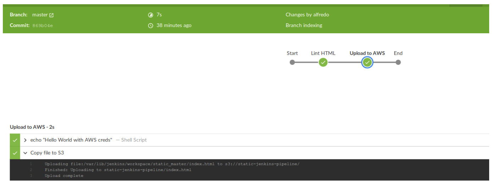

# Jenkins Pipeline on AWS

Creating and running an instance on AWS, configure Jenkins, and create a pipeline to deploy a static website on S3

## Table of Contents
- [Getting Started](#getting-started)
	- [Tools Required](#tools-required)
	- [Installation](#installation)
- [Development](#development)
- [References](#references)

## Getting Started

* The project will be evaluated by a Udacity code reviewer according to the project [rubric](https://review.udacity.com/#!/rubrics/2575/view)

* The pipeline should look like the below image when run successfully:

  

### Tools Required

* Software Requirements: 
  * Latest Jenkins available
  * “tidy” linter
  * `PuTTY` to SSH into the EC2 instance on a Windows machine
* Cloud Requirements: 
  * AWS Account
  * IAM username and password
  * EC2 Key pair
  * S3 Bucket
* A personal GitHub repository

### Installation

* Download and install putty from [here](https://www.putty.org/)

## Development:

Building a CI/CD Pipeline on AWS involves the following steps:

* AWS Steps
  * Login as root user
  * Create a new group with Full Access to EC2, S3 & VPC. Then create a new user and assign it to that group.
  * Sign in as new IAM User
  * Create new key pair
  * Launch EC2 and add the key pair to it
  * Create security group for vm
    * Add Rule: Custom TCP Rule, Protocol: TCP, Port Range 8080, Source 0.0.0.0/0 
    * Add Rule: SSH Rule: Protocol: SSH, Port range: 22, From source, use the dropdown and select "My IP."
  * Connect to your EC2 instance via SSH

* Install Jenkins On Ubuntu
  * Key commands for installation. Make sure it's the latest version
    * `apt update`
    * `apt upgrade`
    * `apt install default-jdk`

* Set Up Jenkins
  * Visit Jenkins on its default port, 8080
  * Unlock Jenkins with the provided initial password
  * Install recommended plugins
  * Setup an admin user
  * Choose URL on the Instance Configuration page

* Install required plugins
  * Install `Blue Ocean` and `aws-pipeline` plugins

* Set up GitHub
  * Create a new repository in your GitHub account named 'Static'
  * Add `index.html` and `Jenkinsfile` as in the master branch of my repo.
  * Commit and push changes
  * Create a [New personal access token](https://github.com/settings/tokens/new?scopes=repo,read:user,user:email,write:repo_hook)
  * Copy the token and save it somewhere.

* Set up GitHub account in Jenkins
  * Paste the personal access token in form in Jenkins. Click `connect`.
  * Search for `Static` repo and click `create pipeline`
  * Edit `Static` job
    * Select `Scan repository triggers`
    * Select `Periodically if not otherwise run`
    * Select an `interval` of 2 minutes

* Set up AWS credentials in Jenkins
  * Open main Jenkins page
  * Click on credentials
  * Click on `global` and then `add credentials`
  * Choose AWS credentials
  * add `aws-static` on ID
  * Add a description and fill in the AWS Key and Secret Access Key generated when the IAM role was created. Save it

* Set up S3 Bucket
  * Open S3 service for Jenkins user
  * Create a new bucket with default options and uncheck the "Block all public access"
  * Open the configuration panel
  * Select the `Properties` tab, and click on "Static website hosting" to enable it
  * Select the `Permissions` tab and add the following code in `Bucket Policy`:
    *  ```
        {
             "Version": "2012-10-17",
             "Statement": [
                 {
                     "Sid": "PublicReadGetObject",
                     "Effect": "Allow",
                     "Principal": "*",
                     "Action": "s3:GetObject",
                     "Resource": "arn:aws:s3:::jenkins-static-website-pipeline/*"
                 }
             ]
         }
       ```
  * Replace 'NAME_OF_BUCKET' with the bucket that was just created and save it

* Set up pipeline for AWS
  * Edit `Jenkinsfile` in the `Static` repo by adding more stages
    * Add `Upload to AWS` stage to upload the `index.html` file using the region and credentials for AWS
    * Use [withAWS](https://github.com/jenkinsci/pipeline-aws-plugin#withaws) and [s3Upload](https://github.com/jenkinsci/pipeline-aws-plugin#s3upload) utilities from the `pipeline-aws` plugin
  * Save, commit and push. A new run should appear
  * To verify, go to: http://bucket_name.s3-website.region.amazonaws.com/. Replace region and bucket name accordingly.
    
* Add another stage in pipeline
  * Connect to the host where Jenkins is installed
  * Install the tidy linter in the server by adding following system dependency: `sudo apt-get install -y tidy`
  * Add a new stage called `Lint HTML` before the `Upload to AWS` in the `Jenkinsfile`.
  * The command that runs the linter is `tidy -q -e *.html`
  * Save, commit and push
  
## References 
  
* AWS docs on [PuTTY](https://docs.aws.amazon.com/AWSEC2/latest/UserGuide/putty.html)
* pipeline-aws-plugin [repo](https://github.com/jenkinsci/pipeline-aws-plugin)